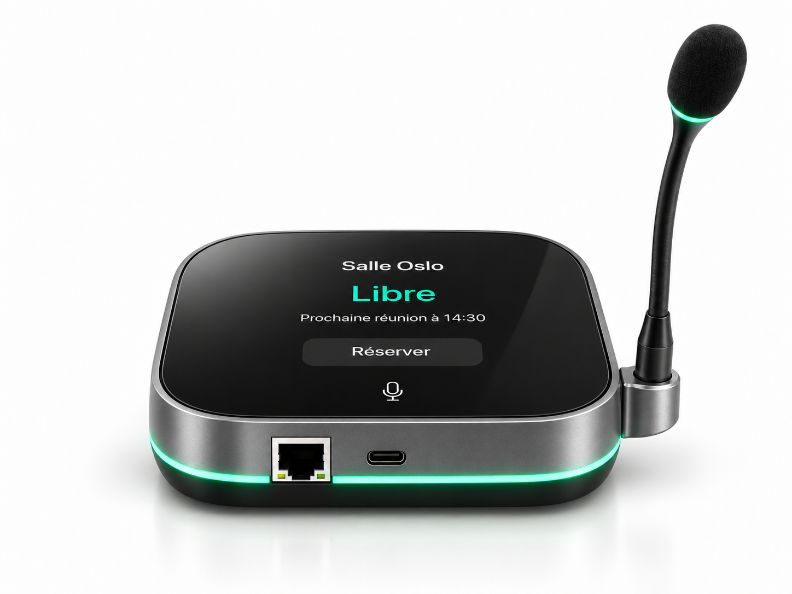
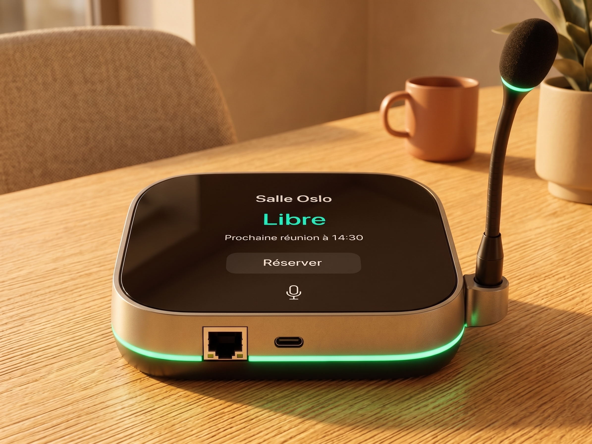
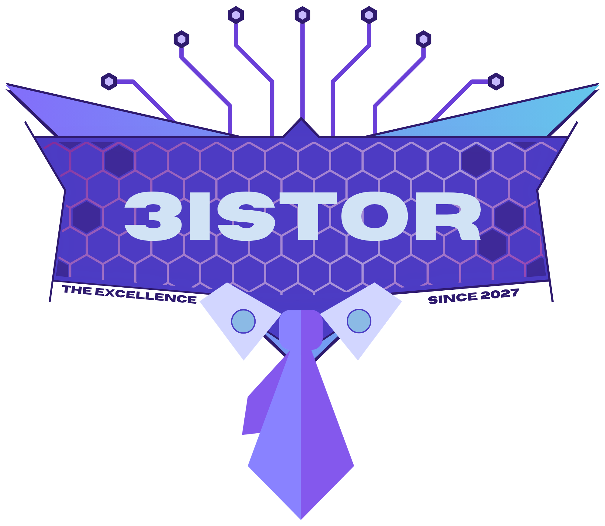

## Le produit {#produit}

OptiSpace est un système de gestion automatique des salles de réunion. Il associe un boîtier IoT installé dans chaque salle, une application web et mobile, un backend cloud et une couche d'analyse d'usage.

À l'heure de la réservation, le boîtier demande une confirmation de présence : un appui sur le bouton physique et la salle passe en occupée. Sans confirmation ni mouvement détecté après un délai paramétrable, la réservation est annulée et la salle redevient réservable par tous, immédiatement.

### Confirmation de présence

Une salle n'est comptée comme occupée que si quelqu'un s'y trouve vraiment. La double validation associe la détection de présence et l'appui volontaire sur le bouton.

### Libération automatique

Le créneau abandonné retourne dans les salles disponibles sans qu'un administrateur ait à intervenir. Le délai avant libération est réglé par l'entreprise.

### Statut lisible depuis le couloir

Un anneau LED indique l'état de la salle : vert pour libre, orange en attente de confirmation, rouge pour occupée, sans avoir à ouvrir son agenda.

### Application web et mobile

Les salles disponibles et occupées en temps réel, la réservation depuis l'application, les notifications. Les connecteurs Google Calendar et Microsoft Outlook sont prévus dans une version ultérieure.

### Tableau de bord d'occupation

Taux d'occupation réel, temps moyen d'utilisation, salles les plus et les moins utilisées, détection des réservations fantômes récurrentes.

### Confidentialité par conception

Aucune caméra, aucun enregistrement audio ni vidéo, microphone désactivable physiquement. Le boîtier ne remonte aucune donnée nominative : seulement des événements de présence et de confirmation.

---

## Fiche produit {#fiche}

Caractéristiques factuelles, à jour au 25 septembre 2027.

| Caractéristique | Détail |
|---|---|
| Nom commercial | OptiSpace |
| Type | Boîtier IoT de gestion de salle, application web et mobile, service cloud avec analyse des résultats par IA |
| Détection de présence | Détection de mouvement, complétée par une confirmation manuelle au bouton |
| Interface | Bouton de confirmation physique, écran d'état, anneau LED tricolore, signal sonore de vérification |
| Caméra | Aucune |
| Microphone | Présent pour la détection sonore de présence, désactivable physiquement. Aucun enregistrement audio. |
| Connectivité | Wi-Fi |
| Alimentation | USB-C |
| Installation | Pose sur table, aucun câblage réseau ni travaux |
| Dimensions | 42 × 40 × 38 mm |
| Prix du matériel | 150 € HT par boîtier, 40 € HT d'installation par salle |
| Abonnement | 39 € HT par mois et par salle jusqu'en 2028 |
| Disponibilité | 15 janvier 2027 |
| Distribution | Devis sur demande, directement depuis le site de 3istor Corp |
| Compatibilités | Application OptiSpace web et mobile. Connecteurs Google Calendar et Microsoft Outlook prévus, pour s'intégrer aux gestionnaires de salles existants |

---

## Visuels haute définition {#visuels}

Téléchargeables directement, sans inscription ni formulaire.

Le boîtier se manipule en 3D ci-dessous. Chaque angle du carrousel se télécharge en pleine définition.

Faites défiler le carrousel : chaque angle se télécharge en pleine définition.

  <model-viewer
    src="assets/models/optispace.glb"
    poster="assets/images/objet/optispace-01-face.png"
    alt="Modèle 3D du boîtier OptiSpace, manipulable à la souris et au doigt"
    camera-controls
    touch-action="pan-y"
    auto-rotate
    rotation-per-second="18deg"
    shadow-intensity="1"
    exposure="1.1"
    environment-image="neutral">
  </model-viewer>
  

    Glisser pour tourner
    Molette pour zoomer
    <a href="assets/models/optispace.glb" download>Télécharger le modèle (.glb)</a>
  

<h3 data-if-model hidden>Le boîtier en situation</h3>

  

    

      <ul class="carousel-track">
        <li class="carousel-slide" data-caption="Vue de face : écran d'état et anneau LED vert, salle libre">
          
        </li>
        <li class="carousel-slide" data-caption="En situation : posé sur la table d'une salle de réunion">
          
        </li>
      </ul>
    

    1 / 2
    <button class="carousel-nav prev" type="button" aria-label="Visuel précédent">&lsaquo;</button>
    <button class="carousel-nav next" type="button" aria-label="Visuel suivant">&rsaquo;</button>
  

  

    
Vue de face : écran d'état et anneau LED vert, salle libre

    

    <a class="carousel-dl" href="assets/images/objet/optispace-01-face.png" download>Télécharger ce visuel</a>
  

### Autres visuels

  <figure class="tile">
    
Capture de l'application web et mobile<code>assets/optispace-application-16-9.jpg</code>

    <figcaption>Application<a href="assets/optispace-application-16-9.jpg" download>Télécharger</a></figcaption>
  </figure>
  <figure class="tile">
    
    <figcaption>Logo 3istor Corp<a href="assets/images/3istor_new_dark.png" download>Télécharger</a></figcaption>
  </figure>

> **Conditions d'utilisation**
>
> Visuels libres de droits pour usage éditorial, crédit : 3istor Corp. Toute utilisation commerciale ou publicitaire nécessite un accord écrit préalable. Les visuels ne doivent pas être modifiés autrement que par recadrage.

---

## L'équipe {#equipe}

Portraits téléchargeables, mêmes conditions d'utilisation que les visuels produit.

  

Arthur Presle

Développeur

  

Hugo Guillet

Chargé de presse et développeur

  

Joe Bejjani

Communication et développement

  

Newfel Levrel

CEO

  

Raphaël Ye

Développeur

  

Brian Peret

DevOps

---

## À propos de 3istor Corp {#entreprise}

Fondée en 2026 au Kremlin-Bicêtre par Newfel Levrel, 3istor Corp conçoit des solutions IoT dédiées à l'optimisation des espaces de travail. La société réunit six associés et déploie OptiSpace, son premier produit.

---

## Contact presse {#contact}

**Hugo GUILLET**, Chargé de presse 
[hugo.guillet@epita.fr](mailto:hugo.guillet@epita.fr), +33 7 86 25 39 06

Nous répondons aux demandes de visuels complémentaires, d'interview ou de test produit sous 48 heures ouvrées.

[Communiqué de presse (PDF)](assets/Communique_de_presse_OptiSpace_3istor_Corp_VF.pdf){: .btn .btn-primary download="download"}
