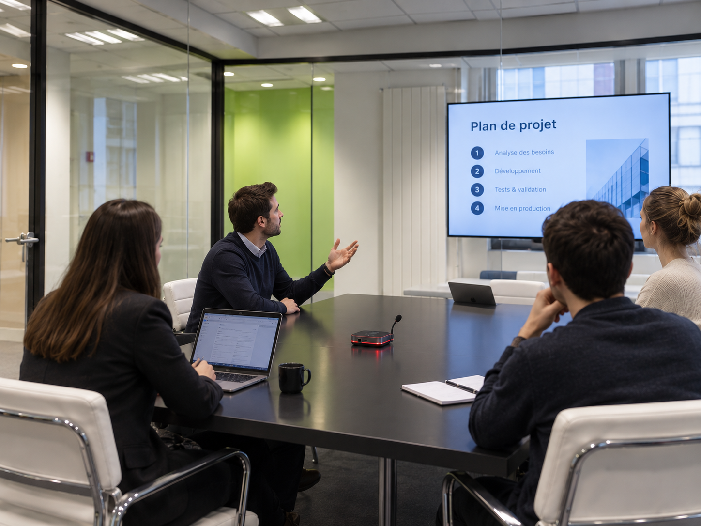

## Le produit {#produit}

OptiSpace est un système de gestion automatique des salles de réunion. Il associe un boîtier IoT installé dans chaque salle, une application web et mobile, un backend cloud et une couche d'analyse d'usage.

À l'heure de la réservation, le boîtier demande une confirmation de présence. Seul un appui sur le bouton physique, alors qu'un mouvement vient d'être détecté dans la salle, la fait passer en occupée. Sans cette confirmation à la fin du délai de grâce, la réservation est annulée et la salle redevient réservable par tous, immédiatement.

### Confirmation de présence

Une salle n'est comptée comme occupée que si quelqu'un s'y trouve vraiment. La double validation exige les deux à la fois : un mouvement détecté dans la salle et l'appui volontaire sur le bouton. L'un sans l'autre ne suffit jamais à confirmer.

1. **Réservation** : à l'heure prévue, l'anneau passe à l'orange et le boîtier attend une confirmation.
2. **Période de grâce** : le boîtier laisse un délai pour confirmer, réglé par le responsable désigné dans l'entreprise.
3. **Signaux de présence** : le capteur de mouvement indique si quelqu'un est dans la salle. Le niveau sonore, calculé dans le boîtier, sert seulement à maintenir une salle déjà confirmée.
4. **Confirmation** : un appui sur le bouton, alors qu'un mouvement vient d'être détecté, fait passer la salle en occupée (rouge).
5. **Maintien ou libération** : la salle reste occupée tant que du mouvement ou du son est détecté. Après un délai sans aucun signal, l'anneau repasse à l'orange et une nouvelle confirmation est demandée. Sans réponse, la salle est libérée.

| Situation | Résultat |
|---|---|
| Quelqu'un entre mais n'appuie jamais sur le bouton | La salle reste en attente, puis elle est libérée à la fin de la période de grâce |
| Quelqu'un passe devant le capteur sans appuyer | Rien n'est confirmé, la salle reste en attente |
| Le bouton est pressé dans une salle vide | L'appui est refusé faute de mouvement, la salle reste en attente |
| Du son est détecté, mais aucun mouvement, pendant la période de grâce | Rien n'est confirmé : le son ne confirme jamais une réservation |
| Une réunion est confirmée, puis les participants restent assis et parlent | La salle reste occupée grâce au son, même sans mouvement |
| Une réunion est confirmée, puis la salle se vide | Après le délai sans signal, une nouvelle confirmation est demandée, puis la salle est libérée

### Libération automatique

Le créneau abandonné retourne dans les salles disponibles sans qu'un administrateur ait à intervenir. Le délai avant libération est réglé par le responsable désigné dans l'entreprise.

### Statut lisible depuis le couloir

Un anneau LED indique l'état de la salle : vert pour libre, orange en attente de confirmation, rouge pour occupée, sans avoir à ouvrir son agenda.

### Application web et mobile

Les salles disponibles et occupées en temps réel, la réservation depuis l'application, les notifications. Les connecteurs Google Calendar et Microsoft Outlook sont prévus dans une version ultérieure.

### Tableau de bord d'occupation

Taux d'occupation réel, temps moyen d'utilisation, salles les plus et les moins utilisées, détection des réservations fantômes récurrentes.

### Confidentialité par conception

Aucune caméra, aucun enregistrement audio ni vidéo, microphone désactivable physiquement.

- **Traitement du son 100 % local** : le boîtier ne calcule qu'un niveau sonore, au-dessus ou en dessous d'un seuil, sur quelques secondes. Le son brut n'est jamais stocké ni transmis, et l'indicateur sonore lui-même ne quitte pas le boîtier.
- **Données envoyées au serveur** : uniquement des événements anonymes, à savoir l'identifiant de la salle, l'heure et le type d'événement (mouvement, confirmation, libération). Aucune donnée nominative.
- **Durée de conservation** : réglée par le responsable désigné dans l'entreprise.
- **Accès aux statistiques** : les responsables de l'entreprise, selon leur matrice RACI interne. Les administrateurs OptiSpace n'y accèdent que pour traiter des incidents et assurer la maintenance. Les collaborateurs voient seulement si chaque salle est libre ou occupée en temps réel.

---

## Fiche produit {#fiche}

Caractéristiques factuelles, à jour au 25 septembre 2027.

| Caractéristique | Détail |
|---|---|
| Nom commercial | OptiSpace |
| Type | Boîtier IoT de gestion de salle, application web et mobile, service cloud avec analyse des résultats par IA |
| Détection de présence | Détection de mouvement et appui sur le bouton, les deux étant exigés pour confirmer. Niveau sonore, calculé dans le boîtier, utilisé seulement pour maintenir une salle déjà confirmée |
| Interface | Bouton de confirmation physique, écran d'état, anneau LED tricolore |
| Caméra | Aucune |
| Microphone | Présent pour mesurer un niveau sonore, calculé dans le boîtier, qui sert à maintenir une salle déjà confirmée et ne confirme jamais seul une réservation. Désactivable physiquement. Aucun enregistrement, le son brut ne quitte jamais le boîtier. |
| Connectivité | Wi-Fi |
| Alimentation | USB-C |
| Installation | Pose sur table, aucun câblage réseau ni travaux |
| Dimensions | 14 × 14 × 23 cm, micro déployé |
| Prix du matériel | 150 € HT par boîtier, 40 € HT d'installation par salle |
| Abonnement | 39 € HT par mois et par salle jusqu'en 2028 |
| Disponibilité | 15 janvier 2027 |
| Distribution | Devis sur demande, directement depuis le site de 3istor Corp |
| Compatibilités | Application OptiSpace web et mobile. Connecteurs Google Calendar et Microsoft Outlook prévus, pour s'intégrer aux gestionnaires de salles existants |

---

## Visuels haute définition {#visuels}

Téléchargeables directement, sans inscription ni formulaire.

Le boîtier se manipule en 3D ci-dessous.

  <model-viewer
    src="assets/models/optispace.glb"
    alt="Modèle 3D du boîtier OptiSpace, manipulable à la souris et au doigt"
    camera-controls
    touch-action="pan-y"
    auto-rotate
    rotation-per-second="18deg"
    shadow-intensity="1"
    exposure="1.1"
    environment-image="neutral">
  </model-viewer>
  

    Glisser pour tourner
    Molette pour zoomer
    <a href="assets/models/optispace.glb" download>Télécharger le .glb</a>
  

<h3 data-if-model hidden>Le boîtier en situation</h3>

  

    

      <ul class="carousel-track">
        <li class="carousel-slide" data-caption="En réunion : anneau rouge, la présence a été confirmée">
          
        </li>
        <li class="carousel-slide" data-caption="Anneau vert : la salle est libre et réservable">
          
        </li>
      </ul>
    

    1 / 2
    <button class="carousel-nav prev" type="button" aria-label="Visuel précédent">&lsaquo;</button>
    <button class="carousel-nav next" type="button" aria-label="Visuel suivant">&rsaquo;</button>
  

  

    
En réunion : anneau rouge, la présence a été confirmée

    

    <a class="carousel-dl" href="assets/images/objet/optispace-situation-01.png" download>Télécharger ce visuel</a>
  

> **Conditions d'utilisation**
>
> Visuels libres de droits pour usage éditorial, crédit : 3istor Corp. Toute utilisation commerciale ou publicitaire nécessite un accord écrit préalable. Les visuels ne doivent pas être modifiés autrement que par recadrage.

---

## L'équipe {#equipe}

Portraits téléchargeables, mêmes conditions d'utilisation que les visuels produit.

  

Arthur Presle

Développeur

  

Hugo Guillet

Chargé de presse et développeur

  

Joe Bejjani

Communication et développement

  

Newfel Levrel

CEO

  

Raphaël Ye

Développeur

  

Brian Peret

DevOps

---

## À propos de 3istor Corp {#entreprise}

Fondée en 2026 au Kremlin-Bicêtre par Newfel Levrel, 3istor Corp conçoit des solutions IoT dédiées à l'optimisation des espaces de travail. La société réunit six associés et déploie OptiSpace, son premier produit.

---

## Contact presse {#contact}

**Hugo GUILLET**, Chargé de presse 
[hugo.guillet@epita.fr](mailto:hugo.guillet@epita.fr), +33 7 32 76 10 92

Nous répondons aux demandes de visuels complémentaires, d'interview ou de test produit sous 48 heures ouvrées.

[Communiqué de presse (PDF)](assets/Communique_de_presse_OptiSpace_3istor_Corp_VF.pdf){: .btn .btn-primary download="download"}
